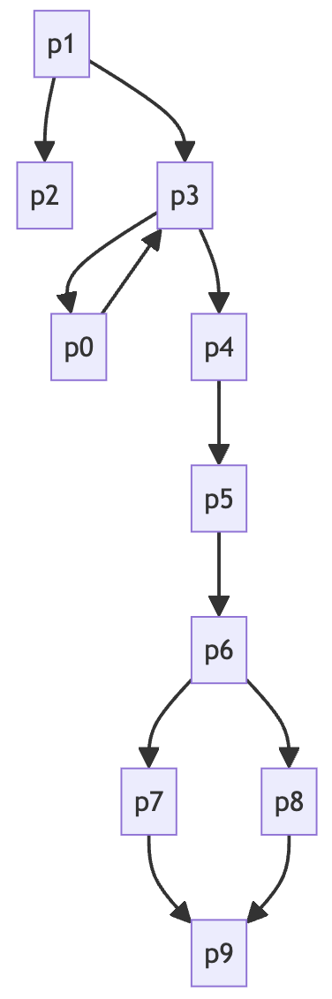
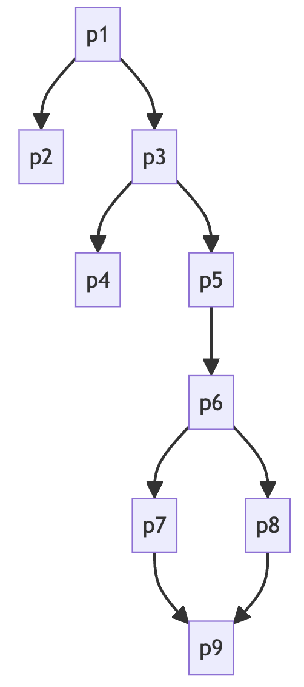
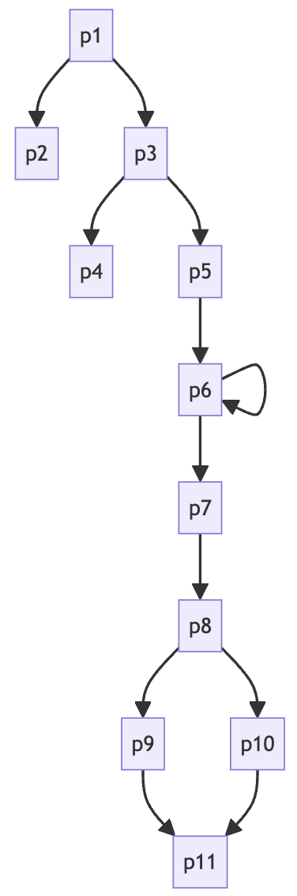
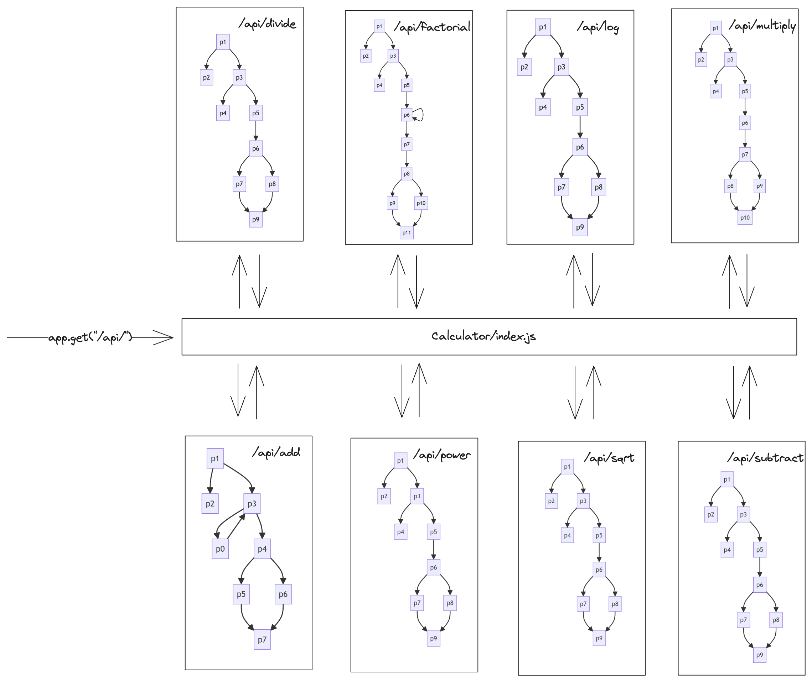
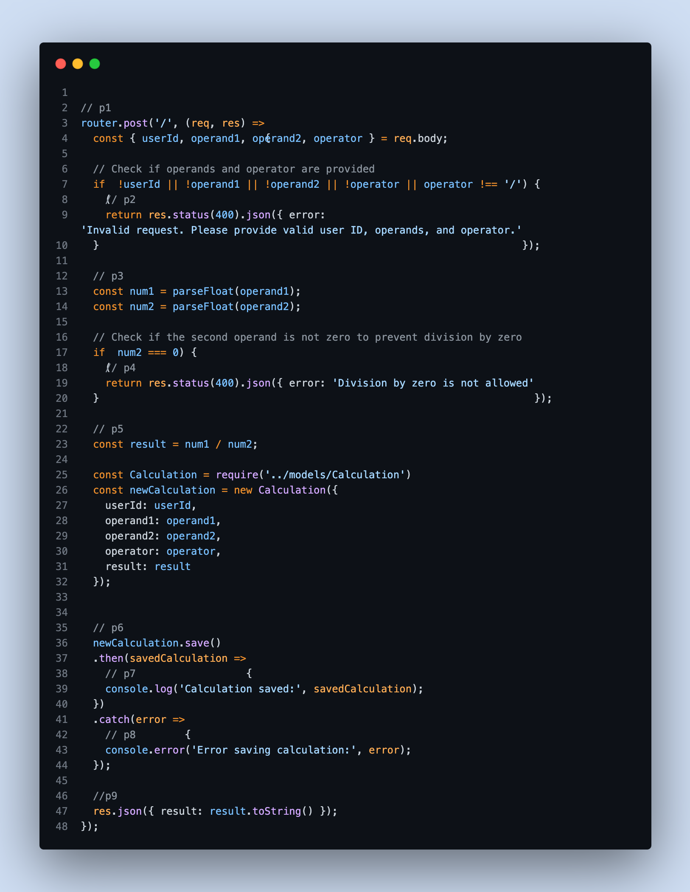
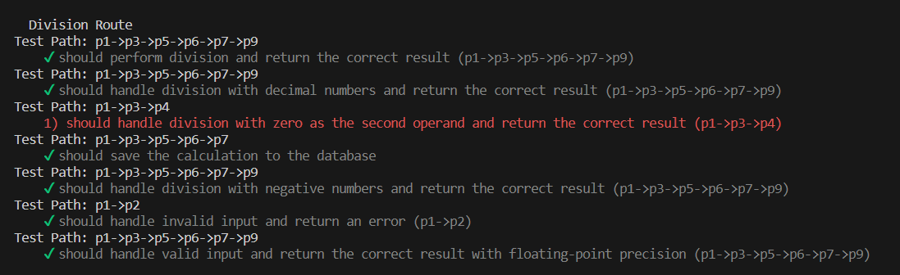

# Calculator Server-Side Web Applications Testing

Project Overview:
This project focuses on testing a server-side calculator application using CIM (Component interaction Model), ATG (Application Transition Graph) Modelling. The goal is to model the server-side code interactions and create effective test cases for comprehensive coverage.

Steps to Follow:
1. Understanding and Modeling the Server-Side Code
2. Test Case Design
3. Tool Selection 
4. Execution and results

## modeling approach
The identification of atomic sections allows for focused testing within the context of CIM and ATG. Testing specific functionalities or interactions becomes more manageable and targeted.

We generated CIM Graphs for our node server and then we combined them to get ATG.

## generated models
<b>CIM examples</b>
(All CIM's can be found in [CIM](server/CIM/))

addition.js 

division.js 

factorial.js 

<b>ATG Graph</b> 
In ATG each node is a cim, transition among cim graphs are represented with edges.

## tools used 
Mocha: Chosen for its robust testing framework, especially its support for asynchronous testing.

Chai: Utilized for expressive and readable assertions, enhancing test readability and understanding.

Chai-HTTP: Specifically employed for testing HTTP services/APIs, providing specialized assertions for API testing.

## test case designs
1. using domain knowledge
1. using Modeled CIM/ATG

<b>Application of Graph-Based Testing:</b> 
Coverage Criteria: Utilizing graph-based coverage criteria (such as node coverage, edge coverage, etc.) to ensure that each node/state and transition in the ATG is covered by test cases.

Path Analysis: Analyzing paths through the ATG to derive test scenarios and identify critical paths that require testing to ensure system reliability and functionality.

<b>Example</b>

the above code shows path coverage for the path p1->p3->p5->p6->p7->p9 for division.js and it's CIM looks like the below image.

The above model inturn maps to our source code in divions.js shown below 

result:

The graph based approch helped us reveal that a test case is failing in division.js and the remaining paths passes succesfully.

Benefits Derived:
Graph-based testing ensures that test cases cover all possible paths and scenarios defined within the CIM/ATG, minimizing the chances of undiscovered issues.

## Results

1. graphical representations of CIM can be found in [/server/CIM/](server/CIM)
2. graphical representations of ATG can be found in [/server/ATG](server/ATG)
3. tests can be run by doing the following
    > cd server  
    > npm i  
    > setup .env file  
    > npm test 

## reports on 
1. test execution
2. anomalies detected 
3. coverage achieved
4. overall assessment of the server-side calculator application's functionality