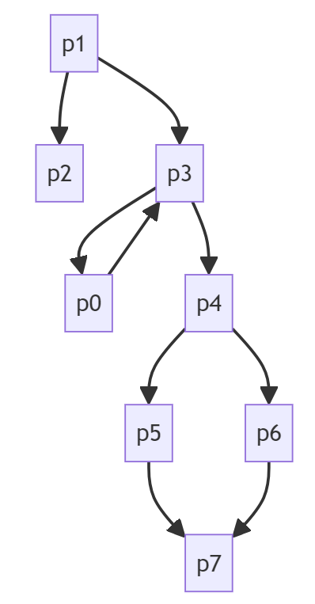

# Calculator Server-Side Web Applications Testing

Project Overview:
This project focuses on testing a server-side calculator application using CIM (Component interaction Model), ATG (Application Transition Graph) Modelling. The goal is to model the server-side code interactions and create effective test cases for comprehensive coverage.

Steps to Follow:
1. Understanding and Modeling the Server-Side Code
2. Test Case Design
3. Tool Selection 
4. Execution and reporting

## modeling approach
atomic section and content variable(dynamic data)

CIM Graph
models individual components
combines atomic section using regular expressions
    sequence p1.p2
    selection p1 | p2
    iteration p1*
    Aggregation p1 {p2}, p2 inside p1
intra component

nodes - atomic section
transitions - how to move from one section to other

ATG Graph
each node is one cim
transition among cim graphs
inter component graph

## tools used 
npm install mocha

## generated models
### Component interaction Model(cim)

#### addition

#### division

#### factorial

#### log2

## test case designs
### Random values
### from session log files
### using domain knowledge
### Using Modeled CIM/ATG 

## execution process

## Graphical Representations and Results

1. graphical representations of CIM, ATG models 
2. interaction graphs related to the calculator application

## reports on 
1. test execution
2. anomalies detected 
3. coverage achieved
4. overall assessment of the server-side calculator application's functionality